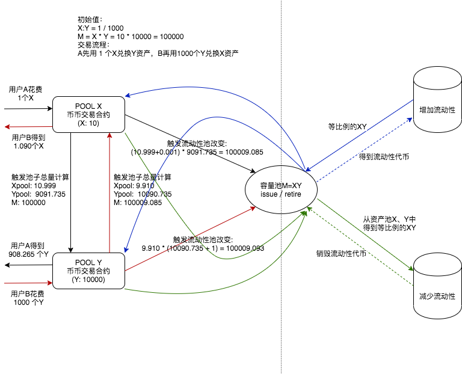
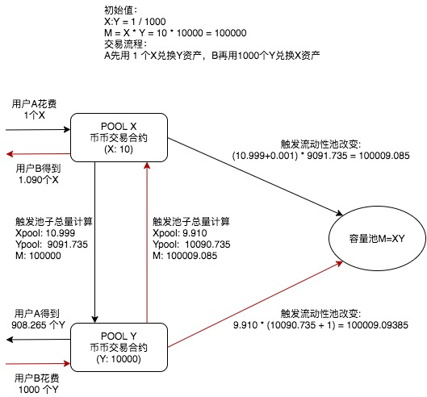
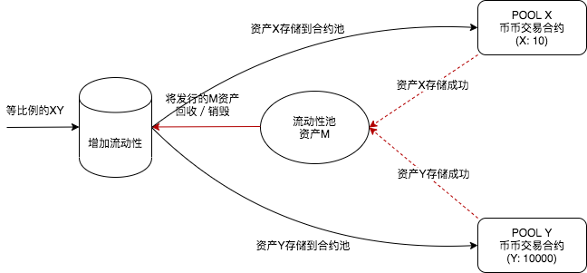
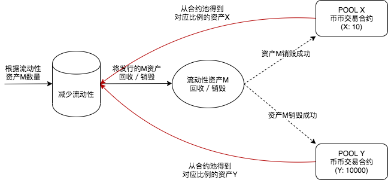

# bytom的uniswap合约实现模型

## uniswap简介

uniswap实现了一个恒定乘积做市商的模型。

### 兑换模型

初始化信息：
X : Y = 1000 / 1
M(invariant) = X * Y = 10 * 10000 = 100000
交易手续费为 0.1%

1） 用 X 来兑换 Y

假如用户A用 1 个 X 来兑换 Y，则可兑换的Y数量为：
手续费（X）为： 1 * 0.1% = 0.001
此时参与计算的 X 池为： 10 + 1 - 0.001 = 10.999
此时参与计算的 Y 池为： 100000 ／ 10.999 = 9091.735
用户A收到的 Y 为： 10000 - 9091.735 = 908.265

兑换完成之后池子变化为：
X 池为： 10.999 + 0.001 = 11
Y 池为： 9091.735
新的流动性池： M = 11 * 9091.735 = 100009.085

2） 用 Y 来兑换 X

基于步骤1）的基础上，假如用户B用 1000 个 Y 来兑换 X，则可兑换的X数量为：

手续费（Y）为： 1000 * 0.1% = 1
此时 Y 池为： 9091.735 + 1000 - 1 = 10090.735
此时 X 池为： 100009.085 ／ 10090.735 = 9.910
用户B收到的 X 为： 11 - 9.910 = 1.090

兑换完成之后池子变化为：
X 池为： 9.910
Y 池为： 10090.735 + 1 = 10091.735
新的流动性池： M = 9.910 * 10091.735 = 100009.09385

### 流动性池管理

假如当前的流动性池为：

M = X * Y 
  = 9.910 * 10091.735 
  = 100009.09385

当前的X和Y的比例为：
X : Y = 9.910 : 10091.735
      = 1 : 1018.338

1) 增加流动性池

假如用户C使用 1 个 X，此时等比例的 Y 为 1018.338，来增加流动性池

用户C能得到的流动性代币为：
C_liquidity = current_C_X * total_liquidity / reserve_X
            = 1 * 100009.09385 / 9.910
            = 1018.338

此时的流动性池变化为：
X池为：9.910 + 1 = 10.910
Y池为：10091.735 + 1018.338 = 11110.073
流动性池M为：M = 10.910 * 11110.073 = 121210.896

2）减少流动性池

基于步骤1）的基础上，假如用户C使用 1 个 X，此时等比例的 Y 为 1018.338，来减少流动性池

用户C将的流动性代币销毁：
Liquidity = total_liquidity - C_liquidity
          = 121210.896 - 1018.338
          = 120192.558

C(X) = C_liquidity * total_X / total_liquidity 
     = 1018.338 * 10.910 / 121210.896
     = 1

C(Y) = C(X) * total_liquidity / total_Y 
     = 1 * 121210.896 / 11110.073
     = 1018.338

此时的流动性池变化为：
X池为：total_X - C(X) = 10.910 - 1 = 9.910
Y池为：total_Y - C(Y) = 11110.073 - 1018.338 = 10091.735
流动性池M为：M = 9.910 * 10091.735 = 100009.09385

## bytom的uniswap实现模型

bytom是utxo模型的区块链，合约中没有单独的存储空间来保存中间变量信息，所以在实现uniswap模型的时候需要借助中心化的存储来保存一些变量信息，
然后通过中心化的秘钥来验证参数的合法性。

bytom系统中的uniswap流程图如下：
  
  

上述流程图大致描述了uniswap的交互流程，里面主要包含了3个合约：X资产池、Y资产池、M资产的总流动性池。

### uniswap交易

流程图如下：
  
  

### 增加流动性

流程图如下：
  
  

### 减少流动性

流程图如下：
  
  