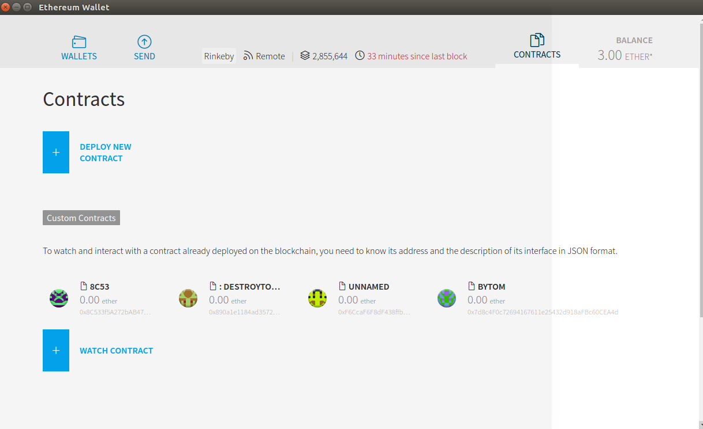
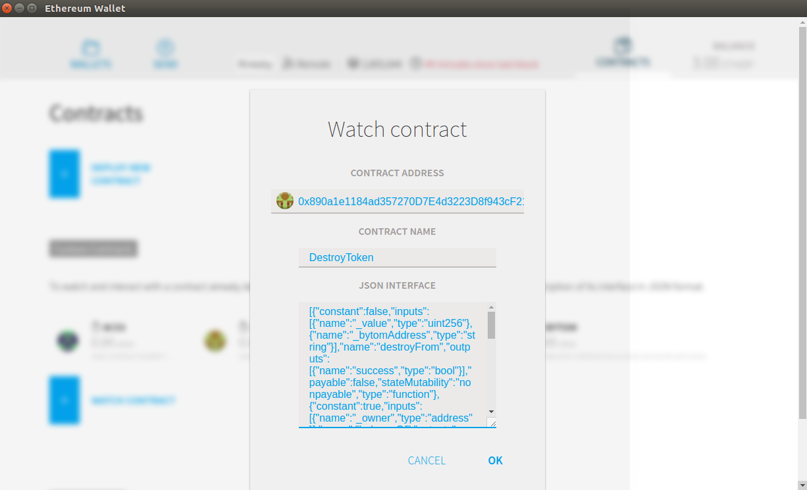
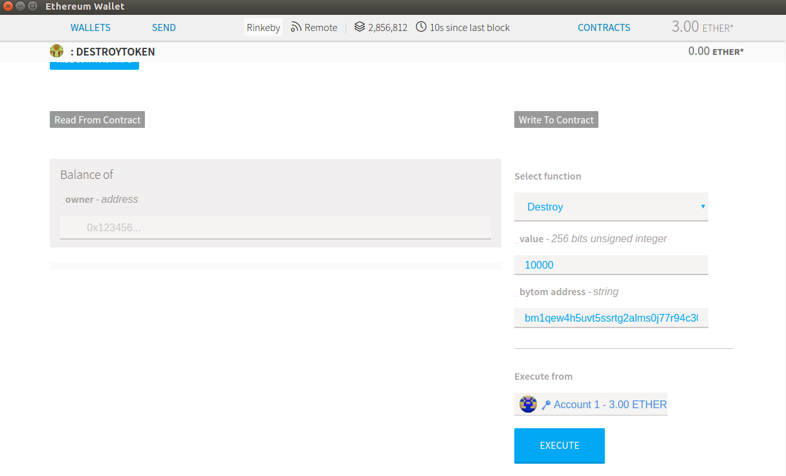
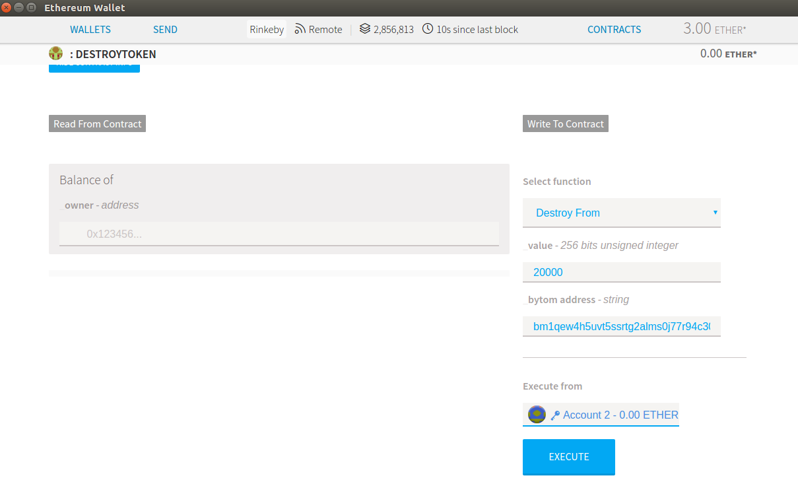

# 销毁erc20 bytom token操作流程

（连接以太坊网络需要先下载以太坊钱包，浏览器钱包操作相对比较方便，下面以mist浏览器钱包为例进行说明）

## 下载以太坊钱包
以太坊官方钱包[ethereum wallet](https://github.com/ethereum/mist/releases)，用户可以根据使用的操作系统，在下图中选择对应的版本，下载解压。其中`MIST`只是以太坊钱包的一个图形界面，后端还是官方的`Geth`。使用图形化的方式操作，可以减少出错的几率，降低使用门槛。`MIST`是使用`Electron`开发的，具有跨平台的能力，所以在各个系统上的界面和操作应该是基本一致的。

  

## 启动以太坊钱包
以`Ethereum-Wallet-linux64-0-11-1.zip`以太坊钱包为例，由于启动时会默认选择主网版本，可以在命令行的方式启动选择测试版本。使用`geth`节点，并且选择`rinkeby`测试网络的启动如下：

```
./ethereumwallet --node geth --network rinkeby
```

启动后会弹出一个图形化的界面如下：

  

上面创建了两个账户`account1`和`account2`，在钱包的最上端`Rinkeby`表示的是以太坊的rinkeby测试网络，如果为则显示为主网的网络标识。

## 连接已部署的销毁合约
点击图形界面的`CONTRACTS`，便可以进入到合约的操作界面（账户需要用户自己创建），如图所示：

  

接下来是如何连接已经部署的销毁token的合约`DestroyToken.sol`，用户可以通过[remix](http://remix.ethereum.org/)获得编译之后的`BYTECODE`和`ABI`，其中合约的源代码如下：
```solidity
pragma solidity ^0.4.16;

contract HumanStandardToken {
    /// @param _owner The address from which the balance will be retrieved
    /// @return The balance
    function balanceOf(address _owner) public constant returns (uint256 balance);

    /// @notice send `_value` token to `_to` from `msg.sender`
    /// @param _to The address of the recipient
    /// @param _value The amount of token to be transferred
    /// @return Whether the transfer was successful or not
    function transfer(address _to, uint256 _value) public returns (bool success);

    /// @notice send `_value` token to `_to` from `_from` on the condition it is approved by `_from`
    /// @param _from The address of the sender
    /// @param _to The address of the recipient
    /// @param _value The amount of token to be transferred
    /// @return Whether the transfer was successful or not
    function transferFrom(address _from, address _to, uint256 _value) public returns (bool success);

    /// @param _owner The address of the account owning tokens
    /// @param _spender The address of the account able to transfer the tokens
    /// @return Amount of remaining tokens allowed to spent
    function allowance(address _owner, address _spender) public returns (uint256 remaining);
}

contract DestroyToken {
    // address of contract HumanStandardToken for bytom
    HumanStandardToken originName;
    // creator of contract DestroyToken
    address creator;
    // receiving address of destroy
    address destroyAddress = 0x0000000000000000000000000000000000000000;
    event Destroy(address _from, address _to, uint256 _value, string _bytomAddress);

    // constructor of contract DestroyToken
    constructor(address _origin) public {
        originName = HumanStandardToken(_origin);
        creator = msg.sender;
    }

    // revert when the user send ETH to this contract
    function () payable public { revert(); }

    // return address balance for bytom erc20 token
    function balanceOf(address _owner) public constant returns (uint256 balance) {
        balance = originName.balanceOf(_owner);
        return balance;
    }

    // transfer bytom erc20 token to destroy address when the contract received token from user,
    // it's successful only that the user approved by bytom contract or the sender is contract creator.
    function destroy(uint256 _value, string _bytomAddress) public returns (bool success) {
        // add some requirements for bytom mainnet address
        bytes memory bytomAddress = bytes(_bytomAddress);
        require((bytomAddress.length == 42 || bytomAddress.length == 62) && uint(bytomAddress[0]) == 98 && uint(bytomAddress[1]) == 109);

        require(originName.balanceOf(this) >= _value && (originName.allowance(msg.sender, this) >= _value || msg.sender == creator));
        originName.transfer(destroyAddress, _value);
        emit Destroy(msg.sender, destroyAddress, _value, _bytomAddress);
        return true;
    }

    // transfer bytom erc20 token to destroy address when the user approved by bytom contract.
    function destroyFrom(uint256 _value, string _bytomAddress) public returns (bool success) {
        // add some requirements for bytom mainnet address
        bytes memory bytomAddress = bytes(_bytomAddress);
        require((bytomAddress.length == 42 || bytomAddress.length == 62) && uint(bytomAddress[0]) == 98 && uint(bytomAddress[1]) == 109);

        originName.transferFrom(msg.sender, destroyAddress, _value);
        emit Destroy(msg.sender, destroyAddress, _value, _bytomAddress);
        return true;
    }
}
```

点击图形界面的`WATCH CONTRACT`，然后填写销毁合约的相关信息，其中合约地址需要填写已部署的`DestroyToken`合约地址，另外还包括合约名称和合约ABI，如图所示：

  

以测试网络已部署的该合约的情况为例，通过区块链浏览器查看如下[0x890a1e1184ad357270D7E4d3223D8f943cF21095](https://rinkeby.etherscan.io/address/0x890a1e1184ad357270D7E4d3223D8f943cF21095)。

## 连接已部署的BYTOM合约
由于销毁`BYTOM erc20 token`需要得到用户的许可或者向销毁合约发送`token`代币，因此需要通过`WATCH CONTRACT`连接已部署的`BYTOM erc20`合约。

[BYTOM合约](https://etherscan.io/address/0xcb97e65f07da24d46bcdd078ebebd7c6e6e3d750#code)可以通过以太坊主网的区块链浏览器查询，其中合约源代码、合约ABI、合约`byte code`等都可以直接获取，无需用户再编译。

按照上个步骤中的操作流程，将`BYTOM`合约也进行创建连接。此外，以太坊测试网络也已经部署的该合约，通过区块链浏览器查看如下[0x7d8c4f0c72694167611e25432d918afbc60cea4d](https://rinkeby.etherscan.io/address/0x7d8c4f0c72694167611e25432d918afbc60cea4d)

## 销毁BYTOM TOKEN
打开`wacth`的`DestroyToken`合约，该合约销毁代币主要有两种方式：`destroy`和`destroyFrom`，后面将一一展开说明，如下图所示：

  

合约函数调用说明：
1、`destroy`函数
调用该函数销毁`token`需要3步：
  1）调用`BYTOM`合约的`approve`来预存用户同意需要销毁的代币数`amount`。以下示例表示账户`account1`同意将`10000 token`发送给`spender`，`spender`即`DestroyToken`合约地址，调用成功后便表示`allowed[account_addr][spender]=10000`设置成功

  

  2）通过`BYTOM`合约的`transfer`将用户同意销毁的代币数`amount`发送到销毁合约地址中。以下示例表示账户`account1`将`10000 token`发送给`to`的销毁合约`DestroyToken`地址

  

  3）通过`DestroyToken`合约将代币数`amount`和`bytom`主网地址作为参数调用`destroy`函数销毁代币。以下示例表示账户`account1`将`amount`为10000的`bytom token`销毁，即发送到全零地址中，同时标注需要兑换的`bytom`主网地址，注意比原的主网地址需要正确填写，否则交易会失败

  

2、`destroyFrom`函数
调用该函数销毁`token`需要2步：
  1）调用`BYTOM`合约的`approve`来预存用户同意需要销毁的代币数`amount`。以下示例表示账户`account2`同意将`20000 token`发送给`spender`，`spender`即`DestroyToken`合约地址，调用成功后便表示`allowed[account_addr][spender]=20000`设置成功

  

  2）通过`DestroyToken`合约将代币数`amount`和`bytom`主网地址作为参数调用`destroy`函数销毁代币。以下示例表示账户`account2`将`amount`为20000的`bytom token`销毁，即发送到全零地址中，同时标注需要兑换的`bytom`主网地址，注意比原的主网地址需要正确填写，否则交易会失败

  

不论调用哪种方式，合约调用交易是否执行成功只需查询交易的详细信息即可。下面介绍一下通过区块链浏览器查询交易是否执行成功，`TxReceipt Status`为`Success`表示销毁成功，另外通过`log`或`inputdata`可以查询到附加的主网地址信息。交易执行成功的案例如下图所示：

  
