# 销毁BYTOM ERC20 TOKEN并附加主网地址的操作流程

（连接以太坊网络需要先下载以太坊钱包，浏览器钱包操作相对比较方便，下面以mist浏览器钱包为例进行说明）

## 下载以太坊钱包
以太坊官方钱包[ethereum wallet](https://github.com/ethereum/mist/releases)，用户可以根据使用的操作系统，在下图中选择对应的版本，下载解压。其中`MIST`只是以太坊钱包的一个图形界面，后端还是官方的`Geth`。使用图形化的方式操作，可以减少出错的几率，降低使用门槛。`MIST`是使用`Electron`开发的，具有跨平台的能力，所以在各个系统上的界面和操作应该是基本一致的。

  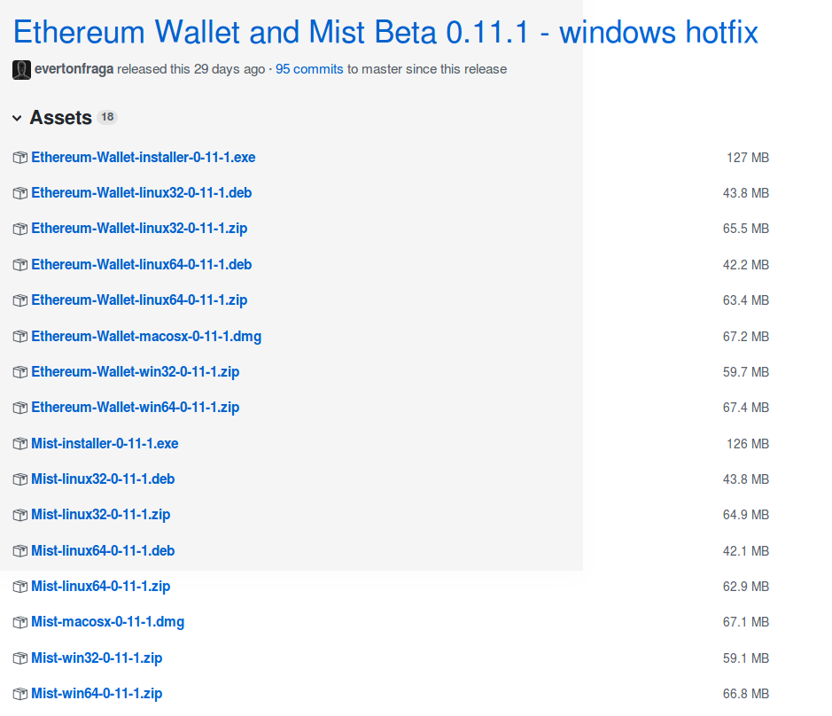

## 启动以太坊钱包
以`Ethereum-Wallet-linux64-0-11-1.zip`以太坊钱包为例，启动时会默认选择主网，可以在启动的客户端修改网络版本，也可以通过命令行的方式选择启动网络版本。使用`geth`节点，并且选择`rinkeby`测试网络的启动如下：

```
./ethereumwallet --node geth --network rinkeby
```

启动后会弹出一个图形化的界面如下：

  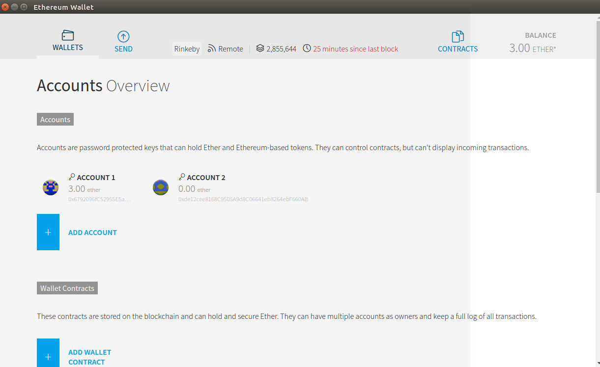

上面创建了两个账户`account1`和`account2`（账户需要用户自己创建或导入），在钱包的最上端`Rinkeby`表示的是以太坊的rinkeby测试网络，如果为则显示为主网的网络标识。

## 连接已部署的销毁合约
点击图形界面的`CONTRACTS`，便可以进入到合约的操作界面，如图所示：

  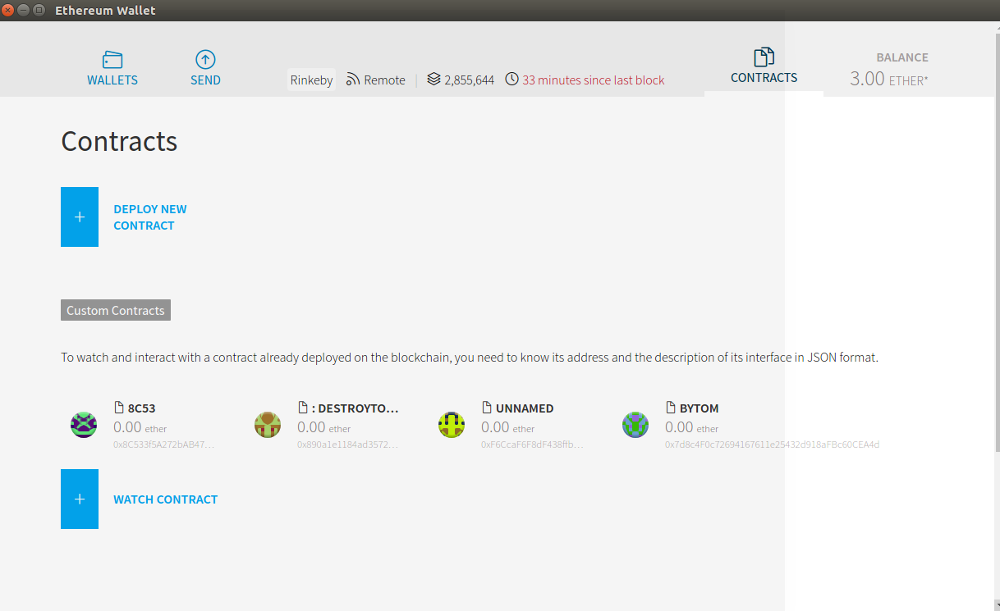

接下来是如何连接已经部署的销毁token的合约`DestroyToken.sol`，用户可以通过[remix](http://remix.ethereum.org/)获得编译之后的`BYTECODE`和`ABI`，其中合约的源代码如下：
```solidity
pragma solidity ^0.4.16;

contract HumanStandardToken {
    /// @param _owner The address from which the balance will be retrieved
    /// @return The balance
    function balanceOf(address _owner) public constant returns (uint256 balance);

    /// @notice send `_value` token to `_to` from `msg.sender`
    /// @param _to The address of the recipient
    /// @param _value The amount of token to be transferred
    /// @return Whether the transfer was successful or not
    function transfer(address _to, uint256 _value) public returns (bool success);

    /// @notice send `_value` token to `_to` from `_from` on the condition it is approved by `_from`
    /// @param _from The address of the sender
    /// @param _to The address of the recipient
    /// @param _value The amount of token to be transferred
    /// @return Whether the transfer was successful or not
    function transferFrom(address _from, address _to, uint256 _value) public returns (bool success);

    /// @param _owner The address of the account owning tokens
    /// @param _spender The address of the account able to transfer the tokens
    /// @return Amount of remaining tokens allowed to spent
    function allowance(address _owner, address _spender) public returns (uint256 remaining);
}

contract DestroyToken {
    // address of contract HumanStandardToken for bytom
    HumanStandardToken originName;
    // creator of contract DestroyToken
    address creator;
    // receiving address of destroy
    address destroyAddress = 0x0000000000000000000000000000000000000000;
    event Destroy(address _from, address _to, uint256 _value, string _bytomAddress);

    // constructor of contract DestroyToken
    constructor(address _origin) public {
        originName = HumanStandardToken(_origin);
        creator = msg.sender;
    }

    // revert when the user send ETH to this contract
    function () payable public { revert(); }

    // return address balance for bytom erc20 token
    function balanceOf(address _owner) public constant returns (uint256 balance) {
        balance = originName.balanceOf(_owner);
        return balance;
    }

    // transfer bytom erc20 token to destroy address when the contract received token from user,
    // it's successful only that the user approved by bytom contract or the sender is contract creator.
    function destroy(uint256 _value, string _bytomAddress) public returns (bool success) {
        // add some requirements for bytom mainnet address
        bytes memory bytomAddress = bytes(_bytomAddress);
        require((bytomAddress.length == 42 || bytomAddress.length == 62) && uint(bytomAddress[0]) == 98 && uint(bytomAddress[1]) == 109);

        require(originName.balanceOf(this) >= _value && (originName.allowance(msg.sender, this) >= _value || msg.sender == creator));
        originName.transfer(destroyAddress, _value);
        emit Destroy(msg.sender, destroyAddress, _value, _bytomAddress);
        return true;
    }

    // transfer bytom erc20 token to destroy address when the user approved by bytom contract.
    function destroyFrom(uint256 _value, string _bytomAddress) public returns (bool success) {
        // add some requirements for bytom mainnet address
        bytes memory bytomAddress = bytes(_bytomAddress);
        require((bytomAddress.length == 42 || bytomAddress.length == 62) && uint(bytomAddress[0]) == 98 && uint(bytomAddress[1]) == 109);

        originName.transferFrom(msg.sender, destroyAddress, _value);
        emit Destroy(msg.sender, destroyAddress, _value, _bytomAddress);
        return true;
    }
}
```

点击图形界面的`WATCH CONTRACT`，然后填写销毁合约的相关信息，其中合约地址需要填写已部署的`DestroyToken`合约地址，另外还包括合约名称和合约ABI，如图所示：

  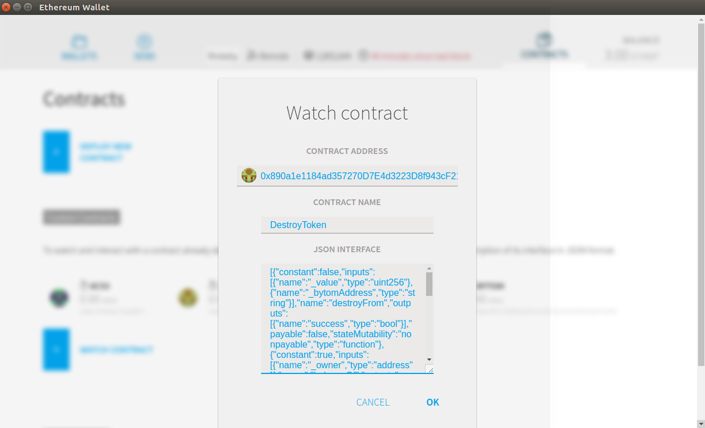

以测试网络已部署的该合约的情况为例，通过区块链浏览器查看如下[0x890a1e1184ad357270D7E4d3223D8f943cF21095](https://rinkeby.etherscan.io/address/0x890a1e1184ad357270D7E4d3223D8f943cF21095)。

## 连接已部署的BYTOM合约
由于销毁`BYTOM erc20 token`需要得到用户的许可或者向销毁合约发送`token`代币，因此需要通过`WATCH CONTRACT`连接已部署的`BYTOM erc20`合约。

[BYTOM合约](https://etherscan.io/address/0xcb97e65f07da24d46bcdd078ebebd7c6e6e3d750#code)可以通过以太坊主网的区块链浏览器查询，其中合约源代码、合约ABI、合约`byte code`等都可以直接获取，无需用户再编译。

按照上个步骤中的操作流程，将`BYTOM`合约也进行创建连接。此外，以太坊测试网络也已经部署的该合约，通过区块链浏览器查看如下[0x7d8c4f0c72694167611e25432d918afbc60cea4d](https://rinkeby.etherscan.io/address/0x7d8c4f0c72694167611e25432d918afbc60cea4d)

## 销毁BYTOM TOKEN
打开`wacth`的`DestroyToken`合约，该合约销毁代币主要有两种方式：`destroy`和`destroyFrom`，后面将一一展开说明，如下图所示：

  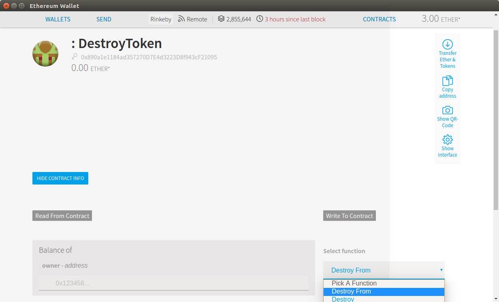

合约函数调用说明：

1、`destroy`函数

调用该函数销毁`token`需要3步：

  1）调用`BYTOM`合约的`approve`来预存用户同意需要销毁的代币数`amount`。以下示例表示账户`account1`同意将`10000 token`发送给`spender`，`spender`即`DestroyToken`合约地址，调用成功后便表示`allowed[account_addr][spender]=10000`设置成功

  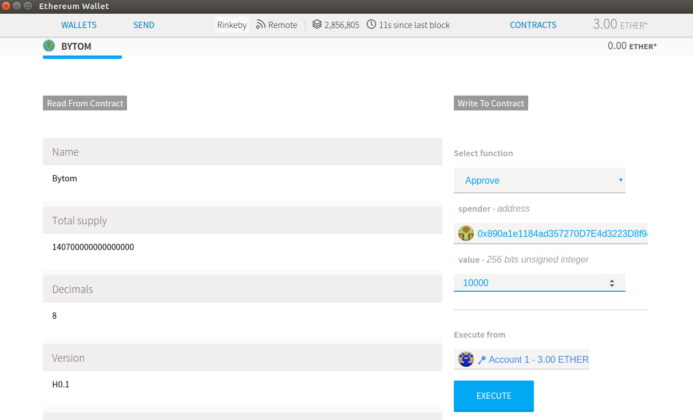

  2）通过`BYTOM`合约的`transfer`将用户同意销毁的代币数`amount`发送到销毁合约地址中。以下示例表示账户`account1`将`10000 token`发送给`to`的销毁合约`DestroyToken`地址

  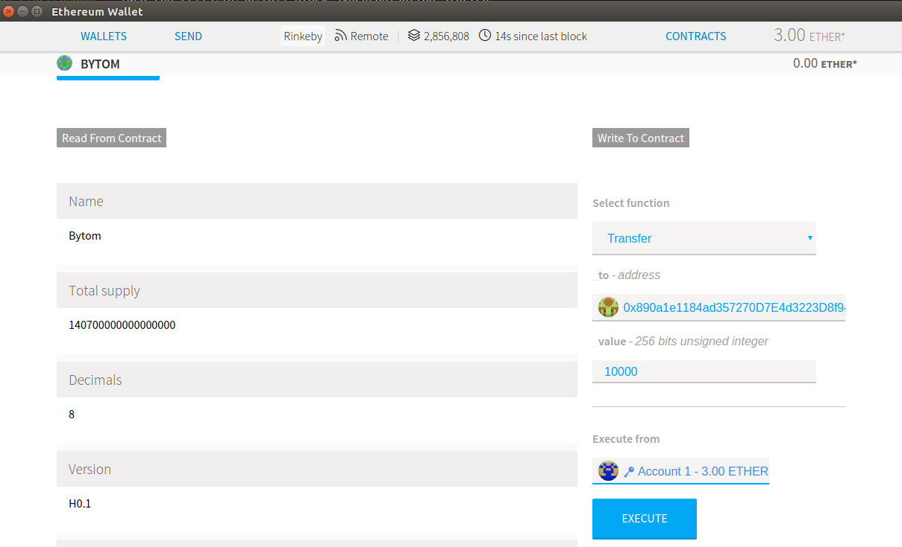

  3）通过`DestroyToken`合约将代币数`amount`和`bytom`主网地址作为参数调用`destroy`函数销毁代币。以下示例表示账户`account1`将`amount`为10000的`bytom token`销毁，即发送到全零地址中，同时标注需要兑换的`bytom`主网地址，注意比原的主网地址需要正确填写，否则交易会失败

  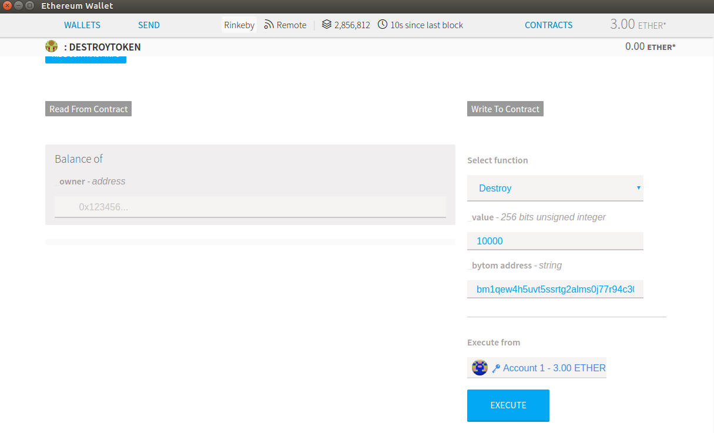

2、`destroyFrom`函数

调用该函数销毁`token`需要2步：

  1）调用`BYTOM`合约的`approve`来预存用户同意需要销毁的代币数`amount`。以下示例表示账户`account2`同意将`20000 token`发送给`spender`，`spender`即`DestroyToken`合约地址，调用成功后便表示`allowed[account_addr][spender]=20000`设置成功

  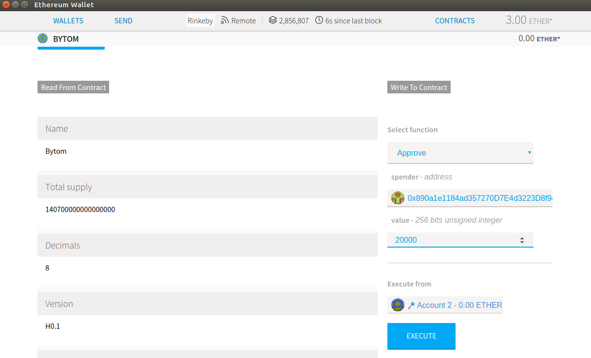

  2）通过`DestroyToken`合约将代币数`amount`和`bytom`主网地址作为参数调用`destroy`函数销毁代币。以下示例表示账户`account2`将`amount`为20000的`bytom token`销毁，即发送到全零地址中，同时标注需要兑换的`bytom`主网地址，注意比原的主网地址需要正确填写，否则交易会失败

  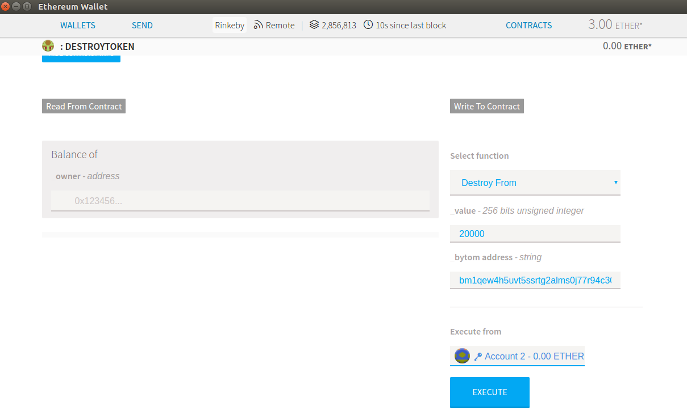

合约调用交易是否执行成功需要通过查看交易的详细信息来进行辨别。下面介绍一下通过区块链浏览器查询交易是否执行成功，`TxReceipt Status`为`Success`表示销毁成功，另外通过`log`或`inputdata`可以查询到附加的主网地址信息。交易执行成功的案例如下图所示：

  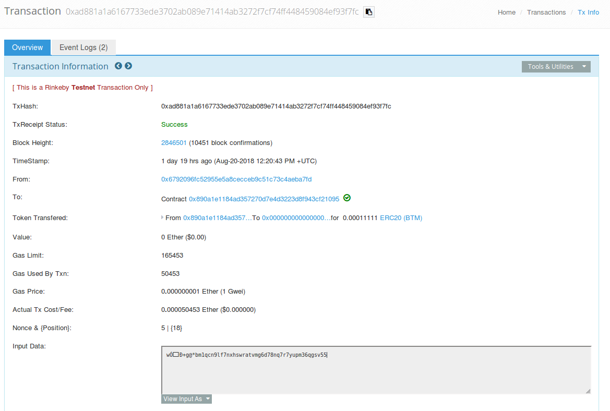
