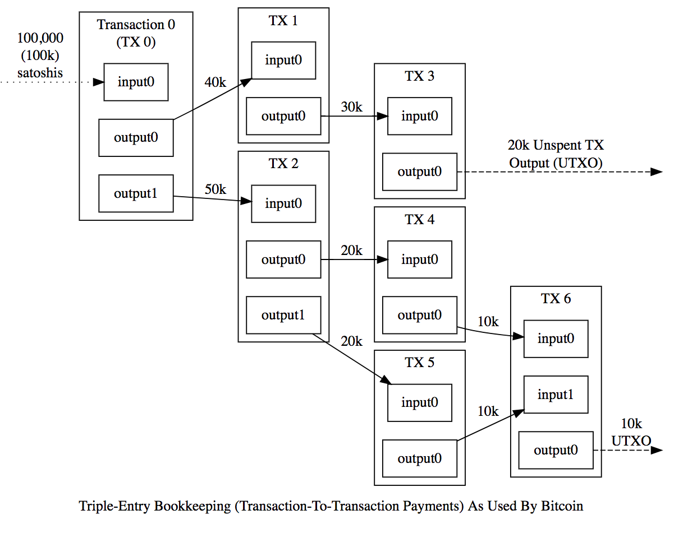

# 区块链系统模型简介

## UTXO模型
  在比特币系统中，每一笔交易花费的输出（outputs）都是之前的交易产生的，而这笔交易的输出（outputs）将会在未来的某一笔交易中花费出去，这种模型便称为UTXO模型。用户的钱包跟踪与用户拥有的所有地址相关联的未花费的交易的列表，并且钱包的余额被计算为那些未花费的交易的总和。UTXO模型跟现实生活中的现金模型相似，每个现金都可以表示为一个UTXO。比特币系统中的流向图如下：
  
  

## 账户模型/余额模型
  在以太坊系统中，账户保存了与它相关交易的余额的世界状态，在每一币笔交易发出之前都需要检查帐户余额以确保其大于或等于支出交易金额。账户模型跟现实生活中银行卡/支付宝/微信等账户的模型相似，所以用户理解起来也相对比较容易。

## 模型对比
  UTXO模型：
  - 可扩展性 如果一个用户有多个UTXO，那么所有的UTXO可以同时被花费掉，而且不会相互影响，所以它具有很好的并行性和扩展性
  - 隐私性 尽管比特币系统不是一个完全的匿名系统，但是UTXO本身具有很高的匿名性，因为用户在接收UTXO的时候都可以使用不同的地址，这样用户实际的钱包花费情况将不能被跟踪

  账户模型/余额模型：
  - 简便 基于账户模型的以太坊最直观的应用是智能合约，多方参与和保存状态信息的特性，使智能合约的应用更具优势。而UTXO模型的只会保存少量的交易状态信息，在这种情况下去设计复杂的合约会显得比较困难。
  - 效率高 账户模型效率高是因为每笔交易只需要验证发送账户有足够的余额来执行交易即可
  - 双花攻击多 基于账户模型的以太坊是通过自增的nonce来防止双花攻击的，每次构造交易的时候都需要修改nonce（每发一笔交易nonce都会加1），这样便可以防止交易被多次提交。但是nonce自增特性也严重影响了以太坊交易的并行程度

  总结：
    不同的区块链系统架构之间各有优点和缺陷，需要在多个方面进行权衡。