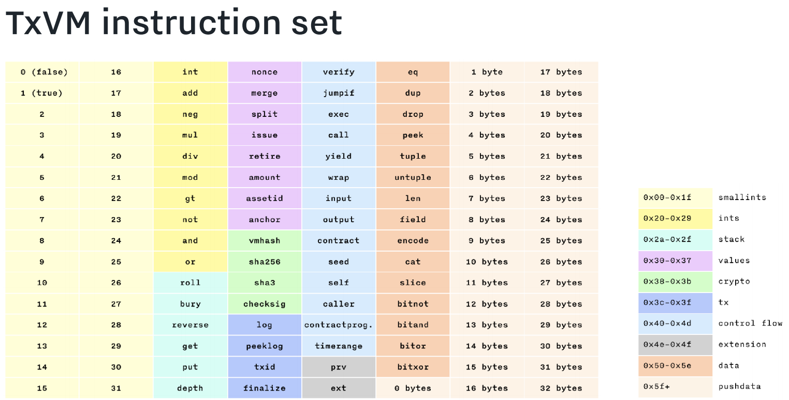

## TXVM介绍
TXVM即交易虚拟机，表示一个新颖的区块链交易形式。TXVM旨在实现一个表达性强、灵活性高的类似于以太坊的命令式合约模型，同时保留了类似于比特币的声明性交易模型的效率、安全和可扩展性。TXVM定义了一个栈式虚拟机来操作解析的数据，其数据类型不仅包括string、integer和tuple基本类型，而且还包含了value（即资产类型aseet和资产数量amount）、contract（锁定了value类型值和其他数据的program）等特殊类型。并且定义了相关规则来处理这些类型的数据，从而保证了完整性和安全性，在TXVM中的每一笔交易在区块链状态中都是独立的，它的输出output是一个确定性的日志log来提示区块链状态的改变，因此交易之间可以并行地被验证。在区块链中使用这些log日志只需要线性相关的时间。

在区块链协议中，交易用于更新区块链的状态（世界状态）。根据区块链协议的不同，交易可以表达为消耗指定数量的token，然后产生新的token；也可以表达为在多个账户之间转账并进行余额的更新。合法的交易被区块链采纳需要参与节点的共识，一旦共识成功便产生了状态的改变。不同的区块链协议有不同的交易形式，也有各自的优点和缺点。

## 区块链模型对比
以下是两种典型的不同的区块链交易形式：

### 比特币
- 交易是一个静态的数据结构，其数据都需要在共识过程中被解析和验证
- 交易模型是声明式的，交易的数据结构直接声明了它提出的状态改变
- 交易可以被并行地验证，同时可以避免产生不可预期的副作用
- 非图灵完备的虚拟机，比特币脚本可以相互独立地进行执行，难于表达多人参与的交互式合约。即使加了更强的指令集，也难于实现复杂的应用。

### 以太坊
- 交易（合约）中嵌入了可变的状态和不变的程序逻辑
- 交易模型是命令式的，在合约逻辑运行完成之前交易对区块的影响是未知的，发送消息来调用合约不仅可以更新自己的状态，如果涉及到合约嵌套，还会改变其他合约的状态
- 以太坊是全局世界状态的，没法通过优化来实现并行验证交易，只能按照确定性的顺序来执行交易
- 一个合约可以改变另外一个合约的状态，执行交易的时候可能产生无法预期的副作用
- 在单个交易的生命周期也难以推导出合约的最终状态

TXVM交易结合了声明式和命令式交易模型的优点，并且尽可能避免了他们的缺陷。TXVM交易是一个命令式的程序，当它执行的时候可以产生声明式的区块链状态改变到log日志中，并且交易产生的世界状态改变是相互隔离的。交易可以并行执行，并且单独地执行也不会对其他合约产生不可预期的副作用。

## TXVM
TXVM定义了一个基于栈式的虚拟机来执行交易程序（字符串类型的字节码），它的指令集是图灵完备的（包含了jumpif指令）。交易程序确定的指令操作引起的状态改变输出（VM数据结构等）会被添加到transaction log日志中，交易程序执行完成后，log日志会应用到区块链中。

一个合约是一个执行程序单元，它包含了合约程序和数据栈两个部分。当合约执行时，它的栈作为VM虚拟机的当前合约栈，同时一些基于栈的操作会被替换。此外，一个合约可能因为各种原因导致执行暂停，同时将控制权移交给其他合约，这样的情况下原来暂停的合约（包含执行的数据栈状态）会被临时保存下来直到被重新唤醒。（整个交易程序看起来像一个隐式的顶级合约）

交易程序执行的时候需要指定一个运行开销上限（runlimit，类似于以太坊的gaslimit），每条指令都有一个非零的开销，一个合约程序执行的总开销不能大于指定的运行开销上限（runlimit），一旦执行的时候超过了这个上限值，交易将被拒绝。一个交易程序合法的标志是程序执行成功并且数据栈为空。

### 数据模型
数据栈支持的数据类型主要分成两大类:（普通数据类型 和 入口类型），此外，为了方便调用，基于两种基本类型扩展生成了一些派生类型。其类型代码对照表如下：
```
    InputCode           : 'I'
    OutputCode          : 'O'
    LogCode             : 'L'
    TimerangeCode       : 'R'
    NonceCode           : 'N'
    IssueCode           : 'A'
    RetireCode          : 'X'
    FinalizeCode        : 'F'
    ValueCode           : 'V'
    ContractCode        : 'C'
    WrappedContractCode : 'W'
```

#### 1）普通数据类型 plain data
- 整型(integer): 64位的整型，范围为[-2^63, 2^63 - 1]
- 字符串(string): 字节型字符串，长度范围为[0, 2^31 - 1]
- 元组(tuple): 不可变的序列，0~N个普通数据类型q

#### 2）入口类型 entries
- 资产数值(values): 特定资产类型的特定资产数量（例如5BTM，10USD），它是一个tuple类型，由4个部分组成: 
    "V"(转换value的类型代码), amount, assetid, anchor

    value可以通过issue创建和retire销毁，在特殊的情形下，零值的value可以通过nonce创建和drop销毁。一个value对象可以被split拆分成两个amount总和相等的value，也可以将两个资产类型相同的value通过merge合并成一个value。

    每个value还包含一个字符串类型的锚anchor，它可以通过nonce、issue或者其他上游的value来创建。锚anchor用于保证value（相同amount和asset）相同时的全局唯一性，同时还能避免重放攻击。

    value是通过锁定（通过满足条件来解锁）合约contracts来确保资产的安全的。每个合约除了包含执行程序和数据栈之外，还包含了合约锁定的value。

- 合约(contracts): 一个合约程序和一个与存储相关的数据栈，它是一个tuple类型，由4个部分组成: 
    "C"(转换contract的类型代码), seed, program, 数据栈内容（0～N）

    合约（contracts）通过contract指令创建，执行成功（同时数据栈为空）便自动销毁。每个合约都包含一个由合约创建时的初始化program程序哈希形成的seed种子，在合约的生命周期中，合约program可能会被output、yield和wrap指令更新，但是seed不会被更新。

    在合约调用合约的情况下，一个合约可能还没有执行完成便被中断（wrap和yield指令可以暂停合约的执行）了，在这种情形下，需要通过output指令将当前的交易状态保存到世界状态中，同时可以通过input指令将原来的状态恢复，这些操作将被记录交易日志log中。

    合约对象的元组tuple可以直接作为input执行的参数，不需要转换为合约可访问的对象。此外，output指令存储的是当前合约状态的镜像ID（snapshotID），如果合约调用者通过input指令恢复世界状态需要自己保存合约tuple对象，只有哈希结果跟snapshotID一致时才能恢复成功。

- 打包合约(wrapped contracts): 一个使用wrap指令可以将原始合约变成便携式的合约，当合约调用的时候，打包合约可以自动解包变成普通合约，它是一个tuple类型，由4个部分组成:
    "W"(转换wrapped contract的类型代码), seed, program, 数据栈内容（0～N）

#### 3）派生类型
（在一些情形下，一些内置类型的值被用作其他特定作用域的类型）

- 布尔类型(boolean): true/false（0/1），入口（entry）类型不能解析成boolean类型

- 程序(program): 程序是有指令序列组成的，每个OPCODE都是由 instruction 和 data（可能为空）组成

- 见证程序(witness program): 指定了交易见证（transaction witness）的程序（program），在合约执行过程中具有“顶级合约”权限

- 合约镜像(contract snapshot): 合约镜像是一个元组，表示合约暂停执行时的运行状态

- 交易见证(transaction witness): 由{version, runlimit, program}组成的元组，是TXVM交易的rawTx。

- 便携式类型(portable types): 当一个合约执行wrap指令变成打包合约(wrapped contracts) 或 执行output指令构建镜像时，数据栈中的元素都是便携式类型，如果数据栈包含非便携式类型，那么执行会报错。普通数据类型和入口类型中除了contract类型，其他都是便携式类型。

### 相关定义
#### 参数栈
参数栈（argument stack）是一个共享的数据栈，用于传递合约数据。参数栈可以包含普通类型和入口类型数据，通过put指令可以将合约栈的元素移动到参数栈中，通过get指令则作用相反。

#### 合约栈
每个合约都有一个合约栈（contract stack），合约栈可以包含普通类型和入口类型数据。当一个合约执行时，它的栈将变成当前的合约栈，所有栈相关的额指令操作都会在当前的合约栈中。此外，如果合约执行wrap和output指令，它的栈必须只包含便携式类型的数据。

#### 交易日志
交易日志（transaction log）是运行TXVM交易的主要结果，用于描述一些指令对交易产生的作用。交易ID是根据log日志内容计算的哈希hash结果。一笔交易通常包含一个或多个签名，签名的信息message通常是交易ID（也可能包含其他数据）。

这里会出现一个典型的鸡和蛋问题：一笔交易包含必需的交易签名验证才能算成功，但是签名需要交易ID作为签名信息，而与此同时交易处于运行的状态中。为了解决这个问题，TXVM使用了finalize指令，该指令通过冻结交易日志log，禁止将来的某个操作去改变它。每笔交易只能执行一次finalize指令，该指令执行完成之后，便可以通过txid指令来计算并查询交易ID。一旦交易ID被计算出来，用户就可以根据该交易ID来计算签名（签名signature作为合约程序的一个参数）。此外，为了确保每笔交易都有唯一的交易ID，finalize指令需要从虚拟机数据栈中消耗一个锚anchor（零值value）。

### 指令集
TXVM的指令集如下：

  

### 守恒定律
定律:在处理合约和对应的锁定值的时候需要保证所有交易只有通过相关的授权才能创建新的锁定值并更新交易余额，同时保证在留有交易记录的情况下才能销毁锁定的value对象。

该定律声明了一笔交易只有当合约指令栈和参数栈都为空的情况下才能表示交易执行成功。value和contract从栈中移出去的情形如下：
- 1）合约执行成功
- 2）value通过retire指令销毁成功，并在transaction log中保存了相关的记录
- 3）执行output指令，创建了一个entry类型的数据保存在区块链的世界状态树中并且允许被恢复，同时在transaction log在保存一条记录信息。

锁定值的生命周期：
一个新的value可以通过issue指令来创建，assetID是issue指令创建资产的唯一标识符，当issue发行合约被认证，其对应的资产发行程序具有唯一性，并且创建人拥有所有相关的决定权。
- 1）零值的value可以用来作为合约的锚anchor，可以在数据栈中自由地复制和移除
- 2）非零值的value在一个时间点只能存在一个地方，并且不能在数据栈中被复制和移除，但是可以通过get和put指令在数据栈中移动
- 3）retire可以销毁一个value，retire入口类型的信息将被保存在transaction log中
- 4）split可以将一个value拆分成两个，merge可以间隔两个value合并成一个

合约的生命周期：
一个合约在同一个时间点不能出现两次，只有通过了合约拥有者的认证才能被存储和销毁。
- 1）当一个合约通过contract指令创建时，它会被存储在父合约的栈中
- 2）当一个合约通过call指令调用时，它会在调用者的合约栈中被移除，并且临时存放在虚拟机的调用栈中。
- 3）当一个合约执行成功并且合约栈为空时，它会被虚拟机销毁
- 4）当一个合约被yield指令暂停时，它将会被放到参数栈中
- 5）当一个合约被output指令暂停时，它的镜像ID将会被移动到全局世界状态中
- 6）当一个合约被input指令恢复时，它将被移动到合约栈中，并且把镜像ID从全局世界状态中移除
- 7）当一个合约被wrapped指令打包时，它会将参数栈的元素变成便携式形式，一个便携式的合约可以被存储在其他合约中，也可以被用户调用
（如果一个打包合约可以像正常合约一个被调用，为什么需要有打包和未打包合约的区别呢？因为它是为了确保合约在没有拥有者认证的情形下，不能被持久化存储在（父合约栈的）世界状态中。一个合约只有拥有者才能执行wrap指令）

### 兼容性
TXVM跟chain协议的版本1和版本2是不兼容的，并且TXVM的交易和区块跟前两个版本也是不一样的，TXVM协议的版本将从3开始。

### 交易模型介绍
#### 典型的交易模型：

```
    A   ----->    B  +  A 
  (5, 7)         (10)  (2)
```
   
- {...} 表示元组tuple
- [...] 表示程序指令的序列

交易步骤如下：(该案例仅用于说明，以下执行合约program指令集可能缺少一部分栈操作的控制指令，建议以实际执行的合约program为准)

    1）从区块链的全局实际状态获取两个合约，将锁定值value和验证签名合约程序program从参数栈移动到当前的执行合约的数据栈中
    {...} input call get get
    {...} input call get get

    2）将两个锁定值value（5和7）放到栈中，并执行merge指令合并成12
    2 roll merge

    3）通过指令split将12（value）拆分成10和2，同时将Bob的pubkey放到栈中，移动位置并将10（value）也放到数据栈中。根据utxo值10（value）和Bob的pubkey构造锁定合约，然后调用合约，并通过output指令输出到该合约中
    10 split <Bob’s pubkey> put put [get get ... output] contract call

    4）通过split将2（value）拆分成2和0，其中0（value）作为finalize指令的锚anchor。构建合约输出模式同上。
    2 split <Alice’s pubkey> put put [get get ... output] contract call

    5）消耗0（value）的锚anchor，并冻结交易日志log，同时计算该状态的交易ID（用于验证交易签名）。在该步骤中，1）步骤需要签名验证的两个合约同样保留在数据栈中。
    finalize

    6）根据冻结交易log计算的交易ID，用户Alice需要使用私钥对输入的两个合约的交易ID进行签名，然后将签名作为参数并调用合约进行虚拟机验证。如果合约执行成功，那么最终的虚拟机数据栈的数据为空。
    <a signature by Alice of this transaction ID> put call
    <a signature by Alice of this transaction ID> put call
    

#### 典型暂停交易案例解析：
    一个简单的验证签名合约程序如下：
    txid <pubkey> get 0 checksig verify

    “未花费的交易输出”合约模型如下：（该合约假定pubkey和value都放在了合约栈中（其中pubkey时通过swap指令读取合约栈的值），put是将锁定值value从合约栈放到参数栈中）
    put [txid swap get 0 checksig verify] yield

    通过yield指令可以暂停合约的执行，以上面的合约program为例，验证签名程序作为一个参数被临时保存起来。暂停合约可以恢复然后重新被调用call，因为program使用了txid，所以只有在finalize指令执行完成之后才能被调用。暂停合约仅仅是延迟了验证签名程序的执行。

    通过上面的描述，合约程序元组tuple可以表示为：(用于input指令后面，该指令会将元组tuple转换成一个合约对象)
    {   
        ’C’,        // contract type
        <seed>,     // contract unique ID
        [txid swap get 0 checksig verify],      // check signature program
        <payee pubkey>,                         // argument
        {’V’, <amount>, <asset ID>, <anchor>}   // contract lock value
    }

    验证签名的合约包含暂停阶段的模型如下：
    get get [put [txid swap get 0 checksig verify] yield] output

    该模型从数据栈中消耗了两个参数：<payee pubkey> 和 <合约锁定值value>，通过output指令将上述程序变成一个“未花费的交易输出”合约。此外，单签合约是一个简化版的合约模型，多签等相关的合约都可以按照上述方式实现。

### TXVM应用场景
#### 发行加密资产（Cryptocurrencies）
加密资产有两个属性：一个是总供应量是受限制的；另一个是发行新资产的方式公开透明的。发行总供应量受限制的资产是根据时间（区块高度时间）来限定的。

#### 订单簿（Order books）
订单簿的功能是借助币币交易合约实现的，其内容大概如下：卖家将自己指定数量和资产的value锁定在合约中，并且提供卖家的地址和买家应该支付的指定数量和资产，如果买家想解锁该合约，需要支付对应的资产value，才能获取卖家锁定的value。

#### 路径支付（Path payments）
路径支付指的是通过路径推导原则只关注结果的产生，从而省略过程的方式。例如用户1需要卖出 X个A资产 来得到 Y个B资产，同时另一个用户2需要卖出 Y个B资产 来得到 Z个C资产，那么路径支付的解决方案是允许买家用 Z个C资产 来购买 X个A资产。

使用路径支付不会牵涉到新合约的创建，路径支付的关键是构建正确的交易以便它能在订单簿合约列表中满足对应的合约顺序。

#### 闪电支付通道（Lightning-style payment channels）
支付通道指的是一群区块链用户可以快速地和隐私地进行交易，并且只需将第一笔和最后一笔交易在区块链上记录，从而避免所有的交易记录上链的支付方式。

#### 第三方托管支付（Escrow payments）
第三方托管支付指的是买卖双方通过信任的第三方来保障支付的过程，该方案可以通过第三方托管合约来实现

#### 抵押贷款（Collateralized loans）
抵押贷款指的是借款方抵押自己的资产来获取他想要的资产，并且提供赎回通道让借款方按照规定的期限来归还贷款的资产，否则抵押的资产将会被贷款方收取。


### TXVM源码结构解析

[TXVM基础结构说明](code.md)


